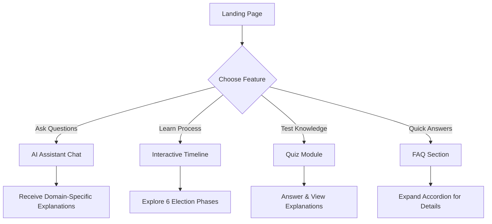

# 🇮🇳 Indian Election Guide | AI Assistant

An interactive, educational web application designed to help citizens navigate the complexities of the Indian electoral system. Built with a modern Glassmorphism UI, this application features an AI-powered chat assistant, an interactive 6-phase election timeline, and an engaging quiz system.

## 🚀 Features

- **🤖 Interactive AI Assistant:** A chat interface that answers questions about the Indian election process, including topics like NOTA, EVM, VVPAT, ECI, and the Model Code of Conduct.
- **📅 6-Phase Election Timeline:** An interactive roadmap detailing the journey from Voter Registration to Polling Day and Results.
- **🎮 Gamified Learning:** A quiz module with informative "Did you know?" explanations to test and expand your knowledge.
- **❓ Comprehensive FAQs:** Quick answers to common questions, including NRI voting rights and NOTA.
- **✨ Modern UI/UX:** A responsive, visually stunning interface using CSS Glassmorphism effects.

## 🏗️ Architecture & Flow

### User Journey Flow


### System Deployment Architecture
```mermaid
graph LR
    subgraph Local Development
        Dev[HTML/CSS/JS Files]
    end
    
    subgraph Docker Container
        Nginx[Nginx Web Server]
        StaticApp[Static Files]
        Nginx --> StaticApp
    end
    
    subgraph Google Cloud Platform
        CloudRun[Cloud Run Service]
        ArtifactRegistry[Artifact Registry]
    end
    
    Dev -. "Docker Build" .-> Docker Container
    Docker Container -. "Push" .-> ArtifactRegistry
    ArtifactRegistry -. "Deploy" .-> CloudRun
    
    User((User)) -->|HTTPS Access| CloudRun
```

## 🛠️ Technology Stack

- **Frontend:** HTML5, Vanilla CSS3 (Glassmorphism styling), Vanilla JavaScript
- **Deployment:** Docker, Nginx, Google Cloud Run

## 💻 Running Locally

Since the application is purely static, you can run it using any local web server.

1. Clone the repository:
   ```bash
   git clone https://github.com/Shivam-coder01/Election.git
   cd Election
   ```
2. Serve the directory:
   - **Using Python:** `python -m http.server 8080`
   - **Using Node:** `npx serve .`
   - **Using PowerShell (Windows):** Run the included `.\serve.ps1`
3. Open `http://localhost:8080` in your web browser.

## ☁️ Deployment (Cloud Run)

The application includes a `Dockerfile` and `nginx.conf` for easy deployment to container platforms like Google Cloud Run.

To deploy using the provided PowerShell script on Windows:
1. Ensure you have the [Google Cloud SDK](https://cloud.google.com/sdk/docs/install) installed.
2. Run the deployment script:
   ```powershell
   .\deploy.ps1
   ```
This script will authenticate your Google account, set the project, build the container, and deploy it to Google Cloud Run.
